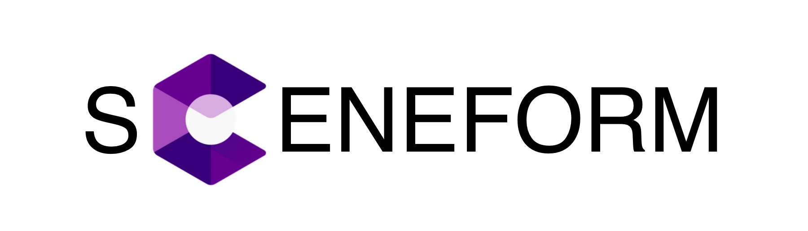
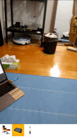
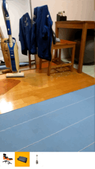
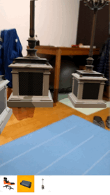
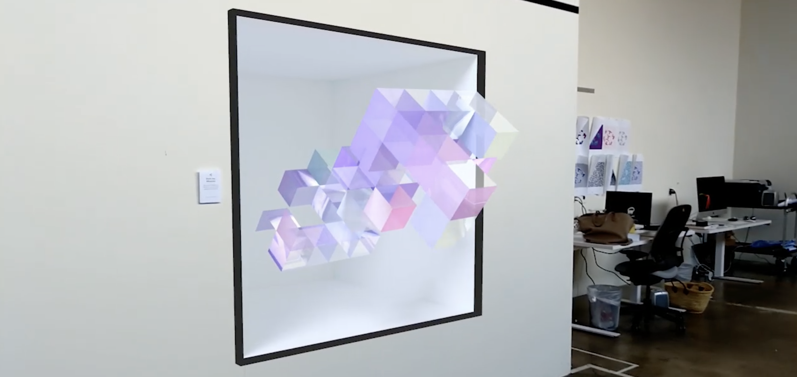
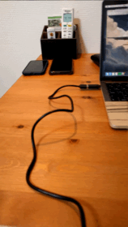
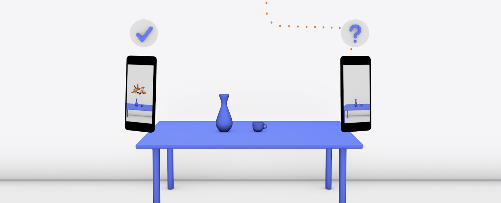
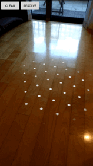
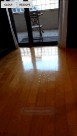

# ARCore-Kotlin-Sampler

## Sceneform

Showing object which is from Google Poly in Sceneform.

>Sceneform makes it straightforward to render realistic 3D scenes in AR and non-AR apps, without having to learn OpenGL
https://developers.google.com/ar/develop/java/sceneform/

### Demo
|chair|lamp|couch|
|:-:|:-:|:-:|
||||

### Assets from Google Poly
- chair https://poly.google.com/view/5osCtu2pLwv
- lamp https://poly.google.com/view/9JPskaLwlIz
- couch https://poly.google.com/view/4QKlmmd0v2b|

## Augumented Images

Showing object on the image which is from Google Poly.

>Recognize and Augment Images
Augmented Images in ARCore lets you build AR apps that can respond to 2D images, such as posters or product packaging, in the user's environment. You provide a set of reference images, and ARCore tracking tells you where those images are physically located in an AR session, once they are detected in the camera view.
https://developers.google.com/ar/develop/java/augmented-images/

### Demo

### Assets from Google Poly
- airplane https://poly.google.com/view/8ciDd9k8wha

## Could Anchors

Save the object persistantly to the place.

### Host an anchor

### Resolve an anchor

